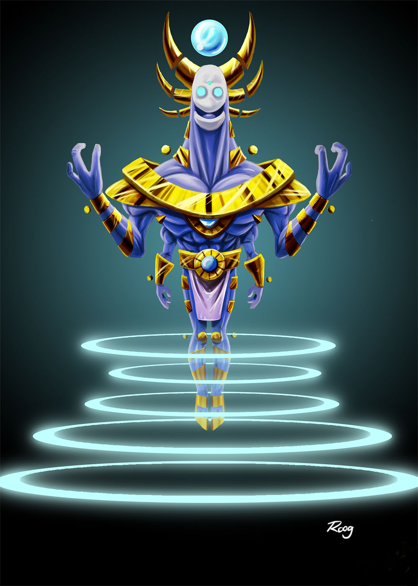
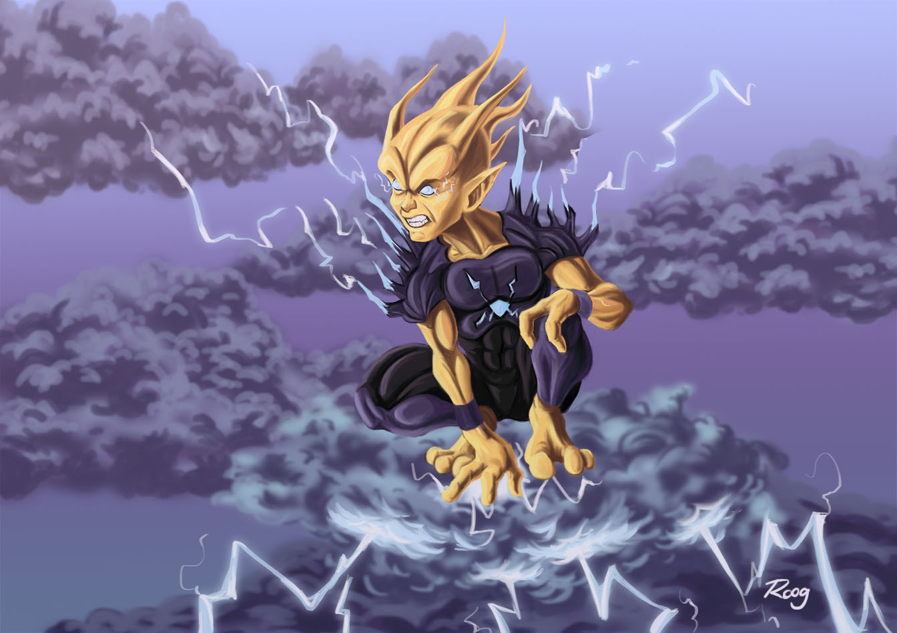
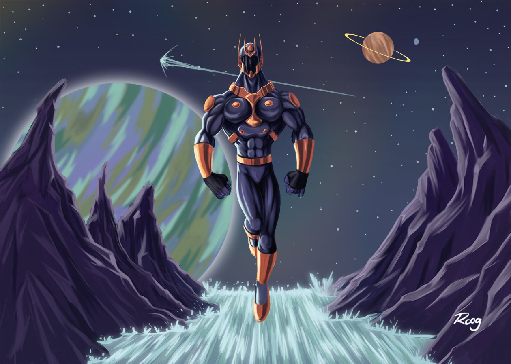
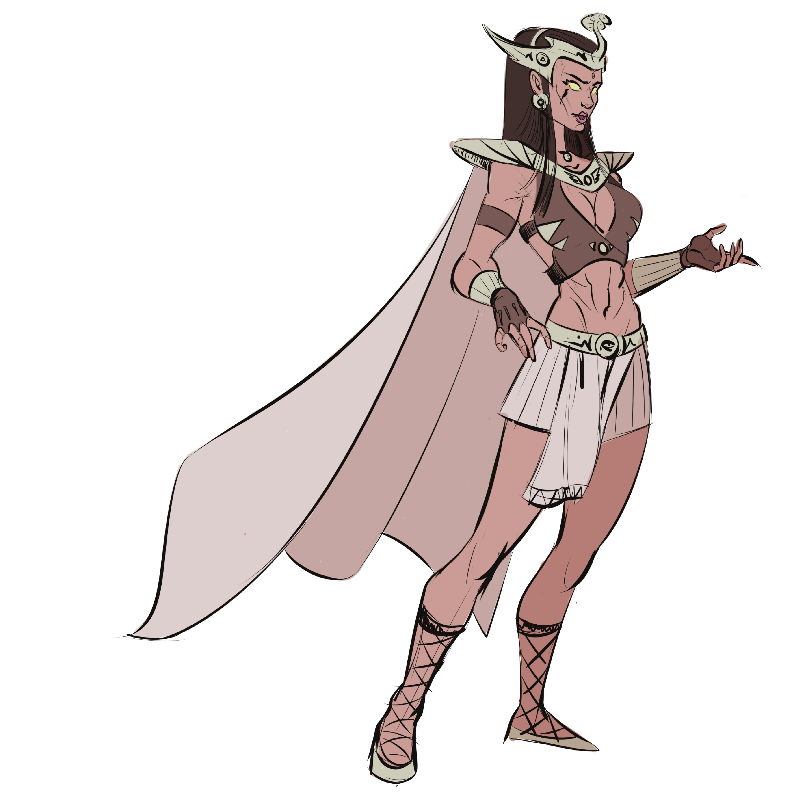
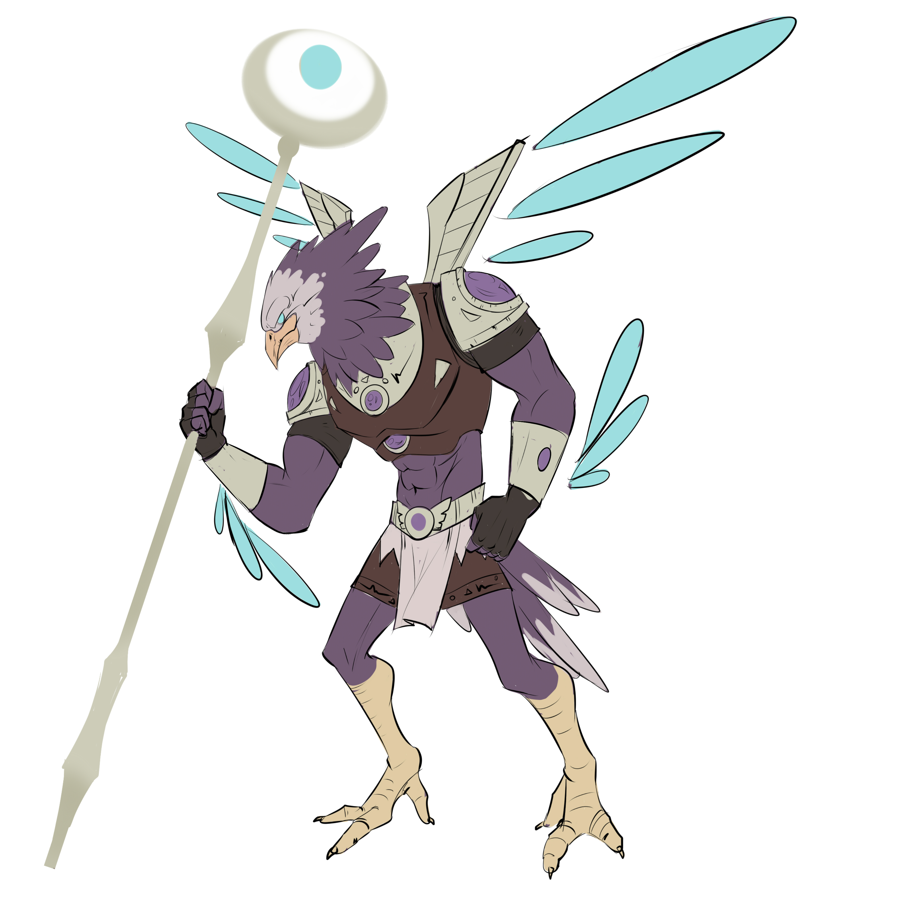

<h1>OLÁ! EU SOU O RODRIGO SOUZA</h1>

    Sou um programador Python iniciante estudando Engenharia da Computação na UNIVESP. Aprendendo sobre IoT, desenvolvimento Web, analise de dados e machine learning.

<h2>HABILIDADES:</h2>

  
  
  
  
  
  

<h2>CONTATO:</h2>

  
  
  

<h2>ALGUNS TRABALHOS DE ILUSTRAÇÃO:</h2>

[<iframe src="[URL_do_Vídeo](https://github.com/RodrigoSouza-Dev/RodrigoSouza-Dev/blob/main/tartarugas%20character%20(1).mp4)" width="400" height="300" frameborder="0" allow="accelerometer; autoplay; encrypted-media; gyroscope; picture-in-picture" allowfullscreen></iframe>
](https://github.com/RodrigoSouza-Dev/RodrigoSouza-Dev/blob/main/tartarugas%20character%20(1).mp4

  <iframe src="tartarugas%20character%20(1).mp4" width="400" height="300" frameborder="0" allow="accelerometer; autoplay; encrypted-media; gyroscope; picture-in-picture" allowfullscreen></iframe>

<iframe src="tartarugascharacter(1).mp4" width="400" height="300" frameborder="0" allow="accelerometer; autoplay; encrypted-media; gyroscope; picture-in-picture" allowfullscreen></iframe>

<iframe src="tartarugas character (1).mp4" width="400" height="300" frameborder="0" allow="accelerometer; autoplay; encrypted-media; gyroscope; picture-in-picture" allowfullscreen></iframe>)https://github.com/RodrigoSouza-Dev/RodrigoSouza-Dev/blob/main/tartarugas%20character%20(1).mp4

  <iframe src="tartarugas%20character%20(1).mp4" width="400" height="300" frameborder="0" allow="accelerometer; autoplay; encrypted-media; gyroscope; picture-in-picture" allowfullscreen></iframe>

<iframe src="tartarugascharacter(1).mp4" width="400" height="300" frameborder="0" allow="accelerometer; autoplay; encrypted-media; gyroscope; picture-in-picture" allowfullscreen></iframe>

<iframe src="tartarugas character (1).mp4" width="400" height="300" frameborder="0" allow="accelerometer; autoplay; encrypted-media; gyroscope; picture-in-picture" allowfullscreen></iframe>
